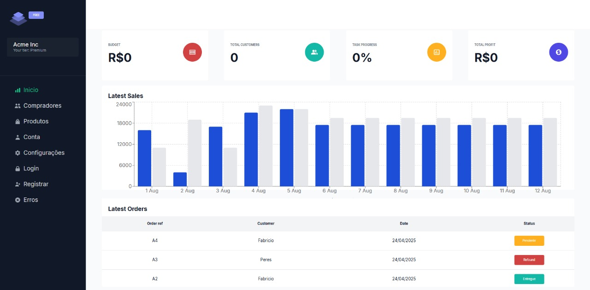

# Site de Gerenciamento de Vendas

Sistema full-stack desenvolvido com **Next.js**, **Tailwind CSS**, **Prisma ORM**, **MySQL** e autenticação via **cookies**. A aplicação permite gerenciar compradores, produtos e vendas em um painel administrativo moderno, responsivo e seguro.

## ✨ Tecnologias Utilizadas

- [Next.js](https://nextjs.org/) — Framework full-stack React
- [TypeScript](https://www.typescriptlang.org/) — Tipagem estática
- [Tailwind CSS](https://tailwindcss.com/) — Estilização moderna com utilitários
- [Prisma ORM](https://www.prisma.io/) — ORM para integração com o banco MySQL
- [MySQL](https://www.mysql.com/) — Banco de dados relacional
- [Cookies HttpOnly](https://developer.mozilla.org/en-US/docs/Web/HTTP/Cookies) — Autenticação persistente e segura

## ⚙️ Como rodar localmente

```bash
# Clone o repositório
git clone https://github.com/DevPeress/Site-de-Gerenciamento-de-Vendas
cd Site-de-Gerenciamento-de-Vendas

# Instale as dependências
npm install

# Configure as variáveis de ambiente
cp .env.example .env
# Edite as informações do banco de dados e secret de JWT no arquivo .env

# Gere o client do Prisma e execute as migrations
npx prisma generate
npx prisma migrate dev --name init

# Inicie o servidor de desenvolvimento
npm run dev
```

## ✅ Funcionalidades

- [x] Cadastro e login de usuários com cookies (HttpOnly e Secure)
- [x] CRUD de produtos
- [x] CRUD de compradores
- [x] CRUD de vendas
- [x] Proteção de rotas
- [x] Dashboard com estatísticas e gráfico de vendas
- [x] Responsividade para dispositivos móveis
- [x] Filtro de busca nas listagens
- [ ] Exportação de dados (em desenvolvimento)

## 🖼️ Preview



> O preview acima representa o dashboard com KPIs, gráfico e listagem de pedidos.

## 🌐 Deploy

A aplicação está disponível em produção via Vercel:  
**[Acessar o sistema](https://site-de-gerenciamento-de-vendas.vercel.app/)**

> Algumas funcionalidades ainda podem depender de configuração local do banco.

## 📁 Estrutura do Projeto

```
├── app/               # Páginas e rotas (Next.js)
├── components/        # Componentes reutilizáveis
├── prisma/            # Schema e migrations do banco de dados
├── public/            # Assets públicos (imagens, ícones)
```

## 👤 Autor

Desenvolvido por [Peres](https://github.com/xPeres)

- GitHub: [@xPeres](https://github.com/xPeres)
- LinkedIn: [in/devperes](https://linkedin.com/in/devperes)
- Instagram: [@fah.peres](https://instagram.com/fah.peres)
- Discord: `PeresDev`

---

> Projeto desenvolvido para portfólio.
